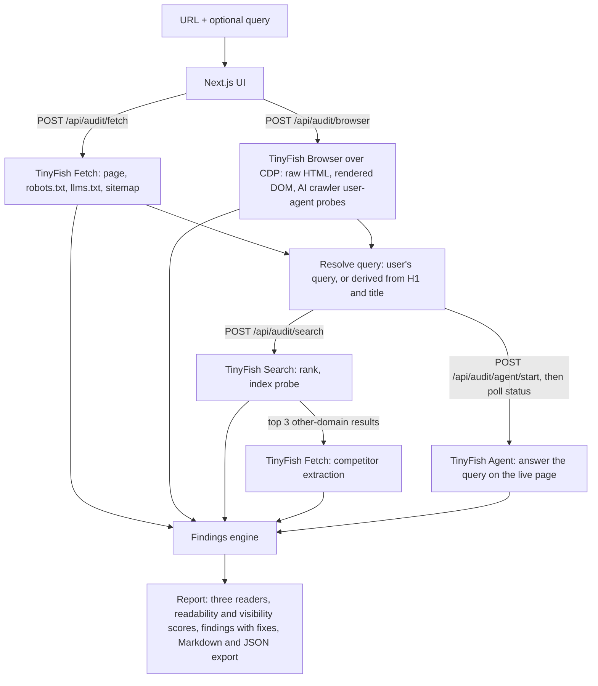

# AI Page Auditor (What AI Sees)

**Live:** _TODO: add the deployed URL_

Paste a URL and an optional target query. The app shows what search engines and AI tools can actually read on that page, where it shows up for the query, and a ranked list of fixes a site owner can apply the same day. TinyFish **Fetch** reads the page the way AI fetch tools do, **Browser** compares the raw server HTML with the rendered page, **Search** checks rank and indexing, and **Agent** tries to answer the query on the live page.

## Demo

**Demo video:** _TODO: add the recording link_

## The idea: one page, three readers

| Reader | What it gets | Measured with |
| :- | :- | :- |
| A person in a browser | The rendered page after JavaScript | TinyFish Browser |
| An AI fetch tool | Cleaned, extracted text | TinyFish Fetch |
| A crawler that skips JavaScript (GPTBot, ClaudeBot, PerplexityBot) | The raw server HTML only | TinyFish Browser (raw response) |

The report puts the three word counts side by side, then explains every gap with evidence from the live page and a concrete fix.

## Code that calls TinyFish

All four APIs are called through a small REST client in [`lib/tinyfish.ts`](lib/tinyfish.ts). Trimmed excerpts:

```ts
// Fetch: the page plus its crawler files in one live batch (lib/stages/fetchStage.ts)
const batch = await tfFetch({
  urls: [pageUrl, `${origin}/robots.txt`, `${origin}/llms.txt`, `${origin}/sitemap.xml`],
  format: "markdown",
  links: true,
  image_links: true,
  ttl: 0, // prefer a live fetch over a cached copy
  purpose: "SEO audit: measure what an AI fetch tool can extract from this live page...",
});

// Browser: raw server HTML vs rendered DOM over CDP (lib/stages/browserStage.ts)
const session = await tfCreateBrowserSession({ timeout_seconds: 180 }); // POST https://api.browser.tinyfish.ai
const browser = await chromium.connectOverCDP(session.cdp_url);
const page = await (browser.contexts()[0] ?? (await browser.newContext())).newPage();
const resp = await page.goto(pageUrl, { waitUntil: "domcontentloaded" });
const rawHtml = await resp.text();        // what a non-JavaScript crawler receives
await page.waitForLoadState("networkidle");
const renderedHtml = await page.content(); // what a person sees

// Search: rank for the target query, then an index probe (lib/stages/searchStage.ts)
const serp = await tfSearch({ query, location: "US", page: 0 });
const probe = await tfSearch({ query: pageTitle, includeDomains: [rootDomain(pageUrl)] });

// Agent: can an AI agent answer the query on the live page? (lib/stages/agentStage.ts)
const { run_id } = await tfStartAgentRun({
  url: pageUrl,
  goal: agentGoal(pageUrl, query), // "Stay on this exact page... report answer_found, evidence_quote, answer_location..."
  output_schema: AGENT_OUTPUT_SCHEMA,
  browser_profile: "lite",
});
const run = await tfGetAgentRun(run_id); // poll GET /v1/runs/{id} until COMPLETED
```

## How to run

Requirements: Node 20 or newer and a TinyFish API key from https://agent.tinyfish.ai/api-keys.

```bash
cd ai-page-auditor
npm install
cp .env.example .env.local
npm run dev        # open http://localhost:3000
```

Environment variables (server side only, never sent to the browser):

| Variable | Required | Purpose |
| :- | :- | :- |
| `TINYFISH_API_KEY` | yes | Key for Search, Fetch, Browser and Agent |
| `AUDITOR_ACCESS_TOKEN` | no | If set, the UI asks for this token before running audits. Use it when deploying publicly so others cannot spend your credits. |
| `TINYFISH_SEARCH_URL`, `TINYFISH_FETCH_URL`, `TINYFISH_BROWSER_URL`, `TINYFISH_AGENT_URL` | no | Override API hosts. Only for the offline test harness. |

If your account does not have the Browser API enabled, or you are out of credits, untick the Browser or Agent box. The report says which checks did not run instead of guessing.

Command line and batch demo:

```bash
npm run audit -- https://example.com/pricing --query "pricing for small teams"
# saves reports/ai-audit-<page>-<run time>.md and .json

npm run demo
# audits every page in demo-pages.json and saves demo-reports/<run time>/:
# one .md and one .json per page, plus index.md comparing them
```

Both commands print each stage as it starts and finishes, plus a "still running" line every 15 seconds; a page usually takes 1 to 3 minutes, mostly the Agent. The web app prints the same `[audit]` lines in the terminal where `npm run dev` runs, while the page shows progress for each stage.

Run times in file names are UTC (for example `2026-10-09-103012`) and match `generatedAt` in the JSON. The web app's download buttons use the same names.

## Architecture



Each stage is its own short API route, so no single request runs the whole audit and the app works on serverless hosts. The report is assembled in the browser from the stage results. Fetch and Browser run in parallel; Search and Agent run in parallel once the query is known.

The stages feed each other rather than running side by side. The Agent's evidence quote is checked against the Fetch extraction and the raw HTML from Browser, which tells the owner exactly which kind of AI tool can or cannot quote that answer. Search results choose the competitor pages that Fetch extracts for the topic-gap finding.

## How TinyFish is used

| API | Calls per audit | What it does here | Why this API |
| :- | :- | :- | :- |
| **Fetch** | 2 to 3 batches | Extraction of the page plus its robots.txt, llms.txt and sitemap; later the top 3 competing pages. | This is what an AI fetch tool reads. Its `title`, `description`, `author` and `published_date` fields show which metadata survives extraction. |
| **Browser** | 1 session | Raw server HTML (before JavaScript), rendered DOM, headers, screenshot, robots.txt read as plain text from inside the page, and the page requested again on the same tab as the AI search crawlers OAI-SearchBot, Claude-SearchBot and PerplexityBot (plus ClaudeBot, a training crawler, for reference), loading only the HTML document. | Fetch returns already-cleaned content, so it cannot show what exists before JavaScript runs, read canonical, meta robots or JSON-LD, or reveal edge blocking of AI crawler user-agents. |
| **Search** | 2 to 3 queries | Rank for the target query (top 20), an index probe (the page's own title within its own domain), and the pages that outrank it. | Visibility: is the page found, for what, and who wins instead. |
| **Agent** | 1 run | Tries to answer the query on the live page; may dismiss pop-ups and open tabs. Structured output: answer found, exact evidence quote, where it was, blockers, missing information. | The only API that interacts with the page, so it finds answers hidden behind clicks and overlays. |

Fetch is asked for a live copy (`ttl: 0`). Per the SDK notes, Fetch may still serve a cached copy when the site's own Cache-Control allows it. Browser and Agent always load the live page.

## How readability connects to visibility

The report scores **AI readability** (crawler access, works without JavaScript, clean extraction, metadata) and **search visibility** (rank for the query, presence in the index), then places the page in a quadrant:

* **Visible but hard to read:** ranks in classic search (often because Google renders JavaScript) while AI answer engines get a much smaller page. Fastest wins are here.
* **Readable but not visible:** AI tools can read it; the bottleneck is relevance, coverage and links. Content-gap findings lead.
* **Neither:** fix readability first, since nothing can rank or cite text it cannot read.
* **Both:** keep the answer early, specific and in the server HTML.

Each connection line is built from observed numbers, for example "Non-JavaScript crawlers receive 6 words; a browser shows 161."

## What the audit checks

* **Access:** Fetch errors (bot challenge, login wall, empty content); a real browser receiving a bot challenge page instead of the content (detected from the title and visible text of the whole page, even with HTTP 200, so bot-manager scripts on normal pages do not count); a first HTML response that is a challenge the browser only passes with JavaScript (non-JS crawlers stop there); robots.txt or sitemap that come back as challenge pages (reported as unknown, never as allow-all, with the start of the response as evidence); robots.txt rules per crawler with RFC 9309 matching, read from the plain-text copy the browser gets when available, and with line breaks restored when Fetch's markdown copy lost them (search, AI search, user-triggered and training bots treated differently); noindex and snippet limits; AI crawler user-agents blocked at the CDN; status and redirects; canonical pointing elsewhere; sitemap listing; llms.txt (rated low priority).
* **Rendering:** share of text that only exists after JavaScript; title, H1, canonical, description or JSON-LD added or changed by JavaScript; query words missing from the raw HTML. Fixes are tailored to the detected stack (Next.js, Nuxt, Angular, SvelteKit, client-only React or Vue, WordPress, site builders).
* **Extraction:** share of visible text Fetch keeps, sections it drops, thin content compared with competitors, missing title or description (with a drafted description from the page's own text), headings, whether the opening text addresses the query, author and date on articles, image alt text.
* **Structured data:** invalid JSON-LD, missing JSON-LD (with a pre-filled suggestion), Open Graph tags.
* **Visibility:** rank, a different URL of the same site ranking instead, index probe, snippet rewritten away from your description.
* **Content gaps:** phrases most top-ranking pages use and this page never does; depth and structure compared with them.
* **Answerability:** the agent could not answer, or was blocked before reading the page; the answer is only on another page; the answer is hidden behind a click or missing from what crawlers receive (checked only when the agent's quote is found on the page as written, so paraphrases never produce findings); overlays and walls in the way.

Every finding lists its evidence, which TinyFish API produced it, a confidence level, why it matters for visibility, and a fix with steps and copy-ready code where it applies.

## Evidence behind the main rules

* GPTBot, ClaudeBot and PerplexityBot fetch HTML but do not execute JavaScript; Googlebot (with Gemini) and AppleBot render. Vercel and MERJ crawler study, Dec 2024: https://vercel.com/blog/the-rise-of-the-ai-crawler
* Blocking OAI-SearchBot keeps a site out of ChatGPT search answers; GPTBot only controls training: https://developers.openai.com/api/docs/bots
* ClaudeBot (training), Claude-SearchBot (search), Claude-User (user fetches): https://support.claude.com/en/articles/8896518
* PerplexityBot respects robots.txt; Perplexity-User generally does not: https://docs.perplexity.ai/docs/resources/perplexity-crawlers
* Google AI Overviews and AI Mode use normal Search eligibility; nosnippet, data-nosnippet and max-snippet apply; Google-Extended does not affect Search: https://developers.google.com/search/docs/appearance/ai-features
* llms.txt shows no clear effect on AI citations across 300k domains, so it is a note, not a fix: https://www.searchenginejournal.com/llms-txt-shows-no-clear-effect-on-ai-citations-based-on-300k-domains/561542/

## Cost and limits

From the TinyFish docs at the time of writing: Search is free up to 12,000 requests a day and Fetch up to 1,000 URLs a day; Browser and Agent use credits. One audit uses about 3 searches, 6 to 10 fetched URLs, one browser session and one agent run. The client backs off on rate limits, and the batch demo pauses 20 seconds between pages.

Routes ask for up to 180 seconds (`maxDuration`); your host's plan must allow that, or the Browser stage may be cut off on slow pages.

## Honest limitations

* **Rankings are TinyFish Search rankings** from its own index, not Google positions. Treat them as directional.
* **Crawler user-agent probes come from a TinyFish residential IP.** Real crawlers use verified IP ranges, so a block in the probe is strong evidence and a pass is weak evidence.
* **The agent's judgment can be wrong.** The report shows its evidence quote so you can check it.
* **Scores are heuristics** for comparing runs and pages, not an industry standard.
* **Topic gaps are lexical:** they compare words and phrases, not meaning.
* **One page per audit;** no site crawl.

## Tests

```bash
npm test           # 157 unit tests: robots.txt matching, extraction stats, HTML facts, findings, scoring, regressions from live runs
npm run typecheck
```

`test-harness/` holds a local test site with known problems and a mock of the four TinyFish APIs that follows the documented request and response shapes, backed by a real local Chromium. It exists only to test the pipeline and UI offline. Real audits always call the real TinyFish APIs on the live page.

## Project structure

```
app/                    Next.js UI and one API route per stage
components/Report.tsx   Report view
lib/tinyfish.ts         REST client for Search, Fetch, Browser, Agent
lib/stages/             fetchStage, browserStage, searchStage, agentStage
lib/parse/              robots.txt, HTML facts, markdown stats
lib/analyze/            findings, scores, readability-to-visibility connection, Markdown export
lib/client/             browser-side orchestration of the stages
scripts/                CLI and batch demo
tests/                  unit tests
test-harness/           local mock and test site (testing only)
```

## Tech stack

Next.js 16, React 19, TypeScript, playwright-core (CDP client for the TinyFish Browser), cheerio, Vitest.
